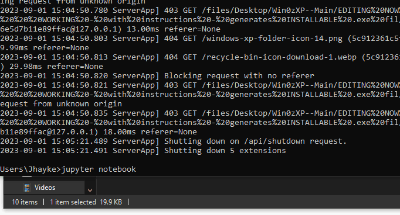

# jupyternotebook
JupyterNotebook for Web traversal through files !  

--- In this video , the browser goes to 
localhost port 8888 , and is opened when Jupyter is ran. 

Below is a display of jupyter notebook , enjoy 

 </img>
